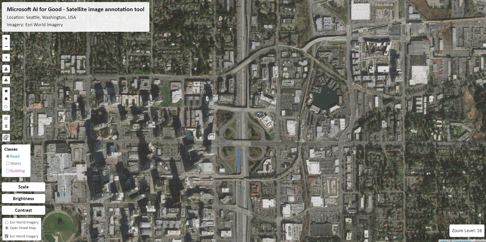

# Satellite imagery annotation tool

This is a lightweight web-interface for creating and sharing vector annotations over satellite/aerial imagery scenes.

Users can select a class from the class list, add polygon and point label annotations over the imagery, then download the layer of annotations as a GeoJSON file that can be easily integrated with other GIS workflows. See the screenshot below for an example:

<p align="center">
    
</p>


## Configuration file format

The tool uses config files passed via the "config" URL parameter to run different "instances", e.g.: `https://server.com/index.html?config=example.json` loads the "example.json" file. The below shows the format of the config file:
```js
{
    "classes": {  // the list of (class name, colors) that will be shown on the frontend
        "Road": "#1976D2",
        "Water": "#757575",
        "Building": "#BA68C8",
        "Completed section": "#CCCCCC"  // The class "Completed section" is a special class that can be used to indicate areas that have already been labeled. If this class is included you can toggle the visibility of polygons labeled as this class independently of the other annotations.
    },
    "center": [47.631850578394406, -122.15389251708986],  // the latitude and longitude of the initial map view
    "boundingBox": [[47.57976811421671, -122.23731994628905], [47.68573021131587, -122.07115173339844]],  // the bounding box for which the basemap is valid
    "layerTitle": "Esri World Imagery example",  // the title of the configuration
    "location": "Seattle, Washington, USA",  // the name of the AOI that the basemap covers
    "basemap": "https://planetarycomputer.microsoft.com/api/data/v1/mosaic/tiles/87b72c66331e136e088004fba817e3e8/WebMercatorQuad/{z}/{x}/{y}?asset_bidx=image|1,2,3&assets=image&collection=naip&format=png", // URL pointing to the basemap; this can be anything that `L.tileLayer` can parse
    "attribution": "Tiles &copy; Esri &mdash; Source: Esri, i-cubed, USDA, USGS, AEX, GeoEye, Getmapping, Aerogrid, IGN, IGP, UPR-EGP, and the GIS User Community", // attribution string to display with the map
    "tms": false // whether the basemap is in a TMS format
}
```


## Example of using cloud optimized GeoTIFFs (COGs) as a basemap

If you have satellite/aerial imagery stored in a cloud optimized GeoTIFF format on the web (e.g. in a Azure blob storage container or S3 bucket) you can use [TiTiler](https://developmentseed.org/titiler/) to render it on-the-fly and use it seamlessly with this tool. 


### Install and run TiTiler

TiTiler can be installed with `pip`. See more options on the [TiTiler documentation page](https://developmentseed.org/titiler/).

```
pip install -U pip
pip install uvicorn
pip install titiler.{package}
```

TiTiler can then be run as a server process that listens on some port (**note**, the machine that you run TiTiler on should be accessible from elsewhere on the web).
```
uvicorn --host 0.0.0.0 --port <PORT> titiler.application.main:app
```
See other ways of deploying TiTiler on [Azure](https://developmentseed.org/titiler/deployment/azure/) or [AWS](https://developmentseed.org/titiler/deployment/aws/intro/).


### Create a config file that uses a TiTiler instance as a basemap

We assume that we have:
- A server, "example.com", that is running a web server on port 80 (the default) that includes the files in this repo in the root directory (i.e. that http://example.com/index.html serves the file from this repo).
- A server, "example.com", that is running TiTiler on port 8888. Note, that this server does not necessarily have to be running on the same machine as the web server.
- A COG file either hosted on _some_ web server (can be on the local server, in the cloud, etc.). For example can use a NAIP aerial imagery COG hosted by Microsoft's [Planetary Computer](https://planetarycomputer.microsoft.com/) -- https://naipeuwest.blob.core.windows.net/naip/v002/fl/2019/fl_60cm_2019/28080/m_2808060_sw_17_060_20191215.tif.

Create the following "test.json" config file on the web server machine:
```js
{
    "classes": {
        "Road": "#1976D2",
        "Water": "#757575",
        "Building": "#BA68C8",
        "Completed section": "#CCCCCC"
    },
    "center": [28.031249, -80.593752],
    "boundingBox": [[27.997976, -80.627296], [28.064522, -80.560208]],
    "layerTitle": "TiTiler + NAIP example",
    "location": "Florida, USA",
    "basemap": "http://example.com:8888/cog/tiles/{z}/{x}/{y}.jpg?url=https://naipeuwest.blob.core.windows.net/naip/v002/fl/2019/fl_60cm_2019/28080/m_2808060_sw_17_060_20191215.tif",
    "attribution": "USDA NAIP Imagery",
    "tms": false
}
```

Finally, you should be able to navigate to "http://example.com/index.html?config=test.json" to create annotations over the NAIP imagery!


## List of third party javascript libraries/versions

We have copied the source of the following library/versions into this repository:

- [leaflet 1.3.1](https://github.com/Leaflet/Leaflet) (BSD-2-Clause License)
  - `js/leaflet.js`
  - `css/leaflet.css`
  - `css/images/layers*.png`
  - `css/images/marker*.png`
- [NOTY 3.1.4](https://github.com/needim/noty) (MIT License)
  - `js/noty.js`
  - `css/noty.css`
- [jquery 3.3.1](https://github.com/jquery/jquery) (MIT License)
  - `js/jquery-3.3.1.min.js`
- [leaflet FileLayer 1.2.0](https://github.com/makinacorpus/Leaflet.FileLayer) (MIT License)
  - Modified version of `js/leaflet.filelayer.js`:
    - Removed features depending on togeoson.js
    - Changed component tag from `<a>` to `<button>` for styling puprposes
    - Removed leaflet-zoom css for styling purposes
- [Leaflet.Range](https://github.com/consbio/Leaflet.Range) ([custom license](https://github.com/consbio/Leaflet.Range/blob/master/LICENSE))
  - Modified to include slider label instead of icon
  - `js/L.Control.Range.js`
  - `css/L.Control.Range.css`
- [leaflet EasyButton 2.4.0](https://github.com/CliffCloud/Leaflet.EasyButton) (MIT License)
  - `js/easy-button.js`
  - `css/easy-button.css`
- [leaflet draw 1.0.4](https://github.com/Leaflet/Leaflet.draw) (MIT License)
  - `js/leaflet.draw.js`
  - `css/leaflet.draw.css`
  - `css/images/spritesheet*`
- [font-awesome 4.1.0](https://github.com/FortAwesome/Font-Awesome) (Icons are CC BY 4.0, fonts are SIL OFL 1.1, code is MIT License, see [here](https://github.com/FortAwesome/Font-Awesome/blob/master/LICENSE.txt))
  - `fonts/*`
  - `css/font-awesome.min.css`
- [leaflet ruler 1.0.0](https://github.com/gokertanrisever/leaflet-ruler) (MIT License)
  - Modified version of `js/leaflet-ruler.js`:
    - Changed the image directory to `css/images/`
  - `css/leaflet-ruler.css`
  - `css/images/icon.png`
  - `css/images/icon-colored.png`


## License

This project is licensed under the [MIT License](LICENSE).


## Contributing

This project welcomes contributions and suggestions.  Most contributions require you to agree to a
Contributor License Agreement (CLA) declaring that you have the right to, and actually do, grant us
the rights to use your contribution. For details, visit https://cla.opensource.microsoft.com.

When you submit a pull request, a CLA bot will automatically determine whether you need to provide
a CLA and decorate the PR appropriately (e.g., status check, comment). Simply follow the instructions
provided by the bot. You will only need to do this once across all repos using our CLA.

This project has adopted the [Microsoft Open Source Code of Conduct](https://opensource.microsoft.com/codeofconduct/).
For more information see the [Code of Conduct FAQ](https://opensource.microsoft.com/codeofconduct/faq/) or
contact [opencode@microsoft.com](mailto:opencode@microsoft.com) with any additional questions or comments.


## Trademarks

This project may contain trademarks or logos for projects, products, or services. Authorized use of Microsoft 
trademarks or logos is subject to and must follow 
[Microsoft's Trademark & Brand Guidelines](https://www.microsoft.com/en-us/legal/intellectualproperty/trademarks/usage/general).
Use of Microsoft trademarks or logos in modified versions of this project must not cause confusion or imply Microsoft sponsorship.
Any use of third-party trademarks or logos are subject to those third-party's policies.
