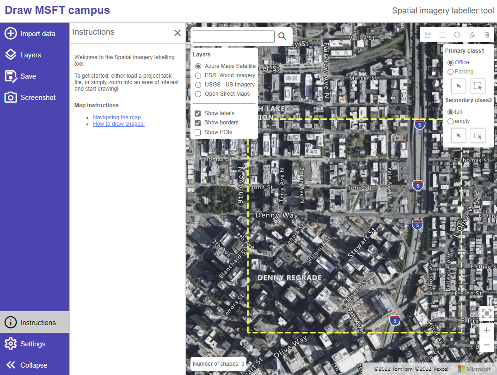

# Spatial imagery labeling toolkit

This is a lightweight web-interface for creating and sharing vector labels (lines or polygons) over satellite/aerial imagery scenes. This project includes the following tools:

- [Project builder](https://microsoft.github.io/satellite-imagery-labeling-tool/src/projectBuilder.html) - Allows you to specify an area of interest, select the imagery layers that can be used for reference, break the area up into chunks and generate tasks files that can be assigned to those who will be doing the labeling. For more details, see the [Project builder documentation](docs/Project-builder.md).
  - Easily break up an area of interest into smaller subsets that can be assigned to individuals via a task file.
- [Labeler](https://microsoft.github.io/satellite-imagery-labeling-tool/src/labeler.html) - Loads a task file for an labeling project (annotation). For more details, see the [Labeler documentation](docs/Labeler.md).
  - Automatically caches data in local browser storage (does not leave your machine) to help prevent data lose from accidental browser refresh or closer. Makes it easy to come back later and continue where you left off. Supports multiple labeling projects by seperating the data by the projects task name. [Learn more](docs/Labeler.md#auto-save-feature).
  - Import existing data from local geospatial files. Supports: GeoJSON, GeoJSONL, KML, KMZ, GeoRSS, GPX, GML, CSV (comma, tab, or pipe delimited).
  - Easily import existing data from Open Street Maps via the [Overpass turbo API](https://overpass-turbo.eu) or a custom data service. Avoids loading in any data for areas that already have drawn features.
- [Project viewer](https://microsoft.github.io/satellite-imagery-labeling-tool/src/projectViewer.html) - View and merge the results from the project. See stats and easily identify which areas have little to no labels. For more details, see the [Project viewer documentation](docs/Project-viewer.md).

Also see the [Documentation](docs/README.md) and the [Spatial imagery ML Jupyter notebook example](example/training-example.ipynb).

**NOTE:** Version 1 of this project uses a different file schema that is not compatible with version 2. You can download version 1 of this project [here](https://github.com/microsoft/satellite-imagery-labeling-tool/releases/tag/public).

[Learn more about Microsoft AI](https://www.microsoft.com/ai)

## Additional Features

- Multi-delete (lasso delete).
- Shift imported data to align with your imagery.
- Support for color themes to align with user preferences.
- Local settings saved so users only have to set their preference once and have those presist across multiple sessions.

Unlock [enhanced functionality with Azure Maps](docs/Layers.md#enhanced-functionality-with-azure-maps)
  - High resolution global satellite imagery.
  - Map labels and points of interest.
  - Location search.
  - Enhanced accessibility (screen reader) capabilities.

## Potential Roadmap

The following are some ideas to take this project further:

- Consider integrating Azure Planetary Computer services. Import imagery layers and/or vector data.
- Add an orthogonalize polygon/squaring option in the labeler to help make drawn features look nicer.
- Magic wand drawing tool that uses a flood fill algorithm on the imagery to generate polygons based on the likeness of nearby pixels.
- Potentially add an option to use fill patterns for features to visualize the secondary class while color is used for the primary class. Alternatively use a fill pattern for the primary class as an alternative to color for better accessibility support for those who are color blind.

Have a feature request? Use the Issues tab of this project repo.

## Related projects

Here are some related projects we recommend checking out:

- [satellite-image-deep-learning](https://github.com/robmarkcole/satellite-image-deep-learning)
- [TorchGeo](https://github.com/microsoft/torchgeo)
- [GlobalMLBuildingFootprints](https://github.com/microsoft/GlobalMLBuildingFootprints)

## List of third party javascript libraries/versions

This project has directly imported and hosted versions of the following third party javascript libraries. This project purposely avoids using NPM and other developer tools and frameworks to keep things simple, so that anyone can easily get this project up and running locally (many users will be data and AI people, not developers).

- [Azure Maps Image Exporter 0.0.2](https://github.com/Azure-Samples/azure-maps-image-exporter) - A helper library for generating screenshots of an Azure Maps control.
- [Azure Maps Bring Data Into View Control 0.0.2](https://github.com/Azure-Samples/azure-maps-bring-data-into-view-control) - Adds a button to the map that makes it easy to focus back to where your data is.
- [JSZip v3.10.1](http://stuartk.com/jszip) - Library for reading and writing zip files.
- [localForage 1.10.0](https://localforage.github.io/localForage) - Makes it easy to store data locally in the browser using a single API. For more information, see the [Labeler's Auto save documentation](docs/Labeler.md#auto-save-feature).
- [Marked 4.0.18](https://github.com/markedjs/marked) - Adds support for markdown syntax, used by the instructions panel.
- [osmtogeojson 3.0.0](https://github.com/tyrasd/osmtogeojson) - A library for converting OSM data into GeoJSON objects.
- [TurfJS 6.5.0](https://turfjs.org/) - A library for performing advanced spatial calculations.

## License

This project is licensed under the [MIT License](LICENSE).

## Contributing

This project welcomes contributions and suggestions.  Most contributions require you to agree to a
Contributor License Agreement (CLA) declaring that you have the right to, and actually do, grant us
the rights to use your contribution. For details, visit https://cla.opensource.microsoft.com.

When you submit a pull request, a CLA bot will automatically determine whether you need to provide
a CLA and decorate the PR appropriately (e.g., status check, comment). Simply follow the instructions
provided by the bot. You will only need to do this once across all repos using our CLA.

This project has adopted the [Microsoft Open Source Code of Conduct](https://opensource.microsoft.com/codeofconduct/).
For more information see the [Code of Conduct FAQ](https://opensource.microsoft.com/codeofconduct/faq/) or
contact [opencode@microsoft.com](mailto:opencode@microsoft.com) with any additional questions or comments.

## Trademarks

This project may contain trademarks or logos for projects, products, or services. Authorized use of Microsoft
trademarks or logos is subject to and must follow
[Microsoft's Trademark & Brand Guidelines](https://www.microsoft.com/legal/intellectualproperty/trademarks/usage/general).
Use of Microsoft trademarks or logos in modified versions of this project must not cause confusion or imply Microsoft sponsorship.
Any use of third-party trademarks or logos are subject to those third-party's policies.
