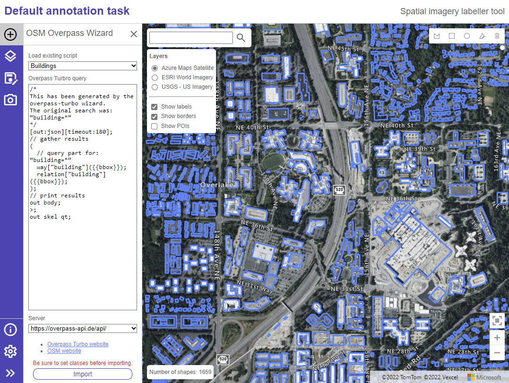

# Labeler tool

The labeler tool is the primary tool that those who will be reviewing the imagery and drawing the data will be using.

## Labeler quickstart

1. Open the [labeling tool](https://microsoft.github.io/satellite-imagery-labeling-tool/src/labeler.html). 
   - **Note** that your project adminstrator may have provided an link that will open up your specific task or may point to a forked version of this tool.
2. Load a labeling project task file (Optional) 
   - If the URL to the labeler contains something like `?taskUrl=[some text]` the labeler will automatically attempt to load in the project task file. 
   - If you have a task file locally, you can open it by going to `Import data -> Local task file` and selecting the local task file. 

Once loaded the map will zoom into the assigned area and display a yellow dashed outline of the area you are expected to label the imagery within. Instructions from the project administrator may appear and provide some guidance on what data to capture.

3. Use the drawing tools in the top right corner to draw features on the map. 
   - Be sure to select the classification of the data using the panel below the drawing tools. 
   - See [Drawing tools documentation](https://learn.microsoft.com/azure/azure-maps/drawing-tools-interactions-keyboard-shortcuts) for details on all the different ways to draw features on the map.
4. When you are done, press the `Save` button on the left side panel.
5. Select the desired output format. The default name and `GeoJSON` file format is often the best option and will allow your project administrator to easily combine your data with a larger data set. 
   - Imported data may include a lot of additional metadata/properties on each shape. The `Minimize exported properties` option will remove these by default. 
  > **Note:** See the [Result file format](#result-file-format) section for more details on the output data schema.

**Tips:**

- The labeler can be used **without a task file** to create labels. No primary or secondary class will be assigned to the features. The OSM Overpass Wizard will use the viewable map area in its query for data.
- Unless disabled in the settings, the labeler will **auto save** the state of the labeling project as you use the tool. If you want to stop and come back later to complete your labeling, simply close the browser tab. The next time you load the tool with the task file, it will look for any saved data for that task. See the [Auto save feature](#auto-save-feature) section for more information.
- If you forgot to do this beforehand you can easily **update the classification** of a shape by clicking on it when out of drawing mode. A pop-up menu appears where you can change the individual classification. Alternatively, there are two buttons in the classification panel that allow for bulk updating by either allowing you to click on multiple features, or by drawing a rectangle to select the features to update.
- If you move the map around and lose sight of your task area, use the **Bring your data into view** button in the bottom right corner just above the zoom buttons.

## Select a layer

The administrator for your project may have specified a selection of imagery layers to use as part of your task. 
* If more than one layer is specified, you can use the **Layers** panel to switch between them. 
* If there are too many layers in the layer panel, click on the **Layers** button in the left side panel. In there is the option to uncheck layers and have them not display in the layers selection panel. In this panel you also have the option to import custom layers if desired. See [Imagery layers](Layers.md) documentation for more information.

### Adjusting the appearance of imagery on the map: 

When you press the **Layers** button from the side menu, a panel appears with filter options that allow you to modify the **brightness**, **contrast**, **hue rotation**, and **saturation** of the imagery on the map. This can be very helpful in situations where it is difficult to distinguish the object you are looking for between other neighboring objects, such as vegetation.

## Import existing data

If you have some existing data you want to import into the labeling tool, there are two ways to do this. You can load a supported data file, or you can load existing data using the OSM Overpass Wizard.
### To load a supported spatial data file
* Use the `Import data -> Local data file` buttons. The supported spatial data file formats are GeoJSON, GeoJSONL, KML, KMZ, GeoRSS, GML, CSV (with a column with well known text of features).
### To load existing data using OSM Overpass Wizard
* Use the `Import data -> OSM Overpass Wizard` buttons. This option may be disabled by the project administrator and not displayed in labeling tool. 
  * The OSM Overpass Wizard leverages [Overpass turbo](https://overpass-turbo.eu/) to import data directly from Open Street Maps. This is a quick and easy way to import a lot of existing data for common spatial data types, like building footprints. 
  * The wizard is context aware and will only load in data that does not overlap with any data you have already drawn (your data has priority). 
  * The wizard may also be disabled if the project drawing is limited to rectangles.

>**_IMPORTANT:_** Open Street Map (OSM) data is great, but note that in imagery AI and machine learning scenarios it is important that the drawn features align with the imagery being used. Not all imagery is perfectly aligned and you may want to adjust the position of imported data from OSM. In the `Settings` panel you can enable shape dragging, then use the edit button in the drawing toolbar to select features and drag them around the map to align them with the selected imagery.

### Add custom OSM wizard scripts

You can create [custom Overpass turbo scripts](https://wiki.openstreetmap.org/wiki/Overpass_API) and add them to the text area when using the labeler.

* If you have forked this project, you can make custom scripts available to your users by adding them to the `src -> overpassScripts` folder, so they appear in the script dropdown.
* You can then go into the `src -> settings -> labeler_settings.js` file and add the script to the `overpassScripts` setting. 
* Be sure to use the `{{bbox}}` in your custom queries as the bounding box area of the area of interest for the task will be passed in to query the data just for the area of the task.

## Auto save feature

The app will automatically save the drawn data on the map while the user is annotating to a local storage in the browser. This provides a safety feature should the user accidentally close or refresh the browser. When the user returns to the labeler tool and loads a task file with the same project name as previously, if there is any cached data, the user will be asked if they would like to continue from where they left off. 

**If they press cancel, the cached data for that project name will be deleted.** 

All cached data will be **deleted after 30 days** by default (you can adjust this in the `labeler_settings.js` file under `autoSave -> ttl`). All data stored within the end user's browser and is not sent to any servers for security and privacy.

By default, the app will attempt to cache data using `indexedDB` which provides access to more than enough storage space. 
* If `indexedDB` is disabled or unavailable in the browser, the app will fallback to the `localStorage` API which has a limit of 5MB of storage (roughly enough for 10K simple polygons like building footprints). 

In most scenarios either of these storage solutions should be sufficient. It is possible that given a large area, and using the OSM importer feature, that more than 10K features would be on the map. 
* If `indexedDB` and `localStorage` API's are not accessible in the browser (rare), this auto save feature will be disabled.

> **_NOTE:_** If your browser or browser tab is in private or incognito mode, the cached data **will be lost** when the tab is refreshed or the browser is closed.

## Settings

In addition to the administrator level settings that are used when a task is loaded (such as the ability to disable the OSM Overpass Wizard), there is a set of settings that is local to each user of the labeler. This allows each end user to customize their expertise in a way that makes it easiest for them to label the data. These settings will persist each time the user returns to the labeler and are independent of any individual project labeling task.

- `Fill polygons` - Specifies if polygons drawn on the map should have their area filled in, or if just their outline should be displayed.
- `Enable snap grid` - The drawing tools uses a small grid of a couple of pixels at the maps current zoom level to snap drawn points to. This helps in aligning adjacent points when drawing, making for better looking data.
- `Continuous drawing` - When enabled you will be able to draw one shape after the other on the map. You must either select another drawing mode (or the same one) to exit the current drawing mode. Although this can make things a lot faster, some users might find they accidentally draw features a lot and wish to disable this.
- `Continuous delete` - When enabled you will be able to delete one shape after another when the delete/erase drawing mode (garbage can) is enabled. By default, this is disabled as it can be easy to accidentally delete features if you forget to exit this mode.
- `Shape drag enabled` - When enabled you will be able to drag whole features when editing. This is useful, but may cause issues for some users when editing points if they don't have the mouse directly over a point (they accidentally end up moving the whole shape).
- `Shape rotate enabled` - When enabled you will be able to rotate features when editing. This is useful, but may cause issues for some users when editing points if they don't have the mouse directly over a point (they accidentally end up rotating the shape).
- `Drawing mode` - Specifies how features are drawn using a mouse or touch:
    - `click` - Coordinates are added when the mouse or touch is clicked.
    - `freehand` - Coordinates are added when the mouse or touch is dragged on the map.
    - `hybrid` - Coordinates are added when the mouse or touch is clicked or dragged.
- `Color theme` - Different color themes for the labeling tool, such as light and dark.

## Take a screenshot

If you want to take a screenshot of your progress, you can use the `Screenshot` tool. Here you can specify the **File name** and **Title** of the screenshot. There is also the option to include **stats** (such as the number of shapes) and **legend** (such as the classes and area of interest) in your screenshot.

## Result file format

The individual result files from the labeler have the following schema:

### Feature properties

When saved as a GeoJSON file, the output will be a feature collection, with each shape being a feature. When saving the drawn features from the labeler, there is an option to limit the properties to just the primary and secondary classes, `source`, and `task_name` properties. 
* If the `saveExtendedGeoJSON` setting in the `src -> settings -> labeler_settings.js` file is set to true, the features `subType` and `radius` will be captured if the shape is a rectangle or circle (the default is false). 
* The class property names are defined in the task file (defaults to `class` for the primary class and `secondary_class` for the optional secondary class), and the value assigned when the shape was drawn based on the selected values in the "class" control. 
* The `task_name` property contains the name of the task and makes it easier to link back where the feature came from.
* The `source` is created by the labeler tool, and provides some insights where the geometry data came from and which imagery layer was displayed when the shape was created or last edited. 

This source property will be a string with one of the following formats:

- `"OSMOverpass"` - The geometry was imported from Open Street Maps using the Overpass turbo API.
- `Drawn|{imagery layer name}` - The geometry was drawn or edited by the user, and was displaying the specified imagery layer.
- `LocalFile|{filename}` - The geometry was imported from a local file by the user. Includes the name of the local file.
- `CustomDataImport` - The geometry was imported using the custom data service set in the project configuration. This only occurs when the project admin has added a custom data service import option to the project.

If the filter option for class and source properties is not checked, all properties in the features will be exported, including any properties that existed on imported features.

> **_NOTE:_** The administrator may override the `class` and `secondary_class` property names in the project builder tool. This will cause the output of the labeling tool to use the administrator specified property names.

## Power tools

The **Power tools** section includes a set of advanced tools that more regular users of these tools may find useful, such as the **multi-delete** buttons and the **shift data** tool.

### Multi-delete buttons

The multi-delete buttons allow you to easily delete multiple shapes on the map. There are two multi-delete options: **Rectangle erase** and **Polygon erase**. 

- `Rectangle erase` - Click this button, then draw a rectangle to delete all intersecting shapes.
- `Polygon erase` - Click this button, then draw a polygon to delete all intersecting shapes.

### Shift data tool

This **Shift data** tool allows you to easily move a set of shapes around the map. This tool is useful when importing data that doesn't align with your projects primary imagery source. Instead of deleting and redrawing the shapes, you can use this tool to move them all at once.
* To do this, select the data that you want to shift from the dropdown menu, and then click the arrow buttons to shift the shapes one pixel in the direction of the buttons arrow. 
* Press and hold down the button to continuously shift the data until you release the button. 

