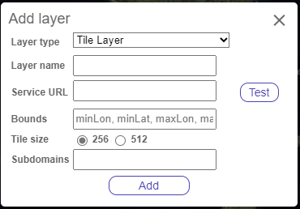
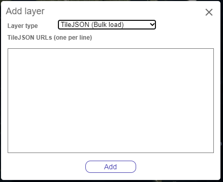
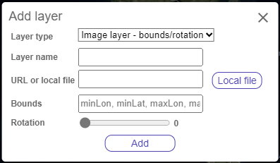
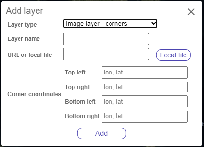
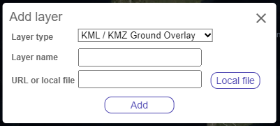
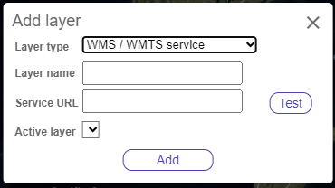

# Imagery layers

Imagery is the primary resource needed in this application. There are many ways to include imagery;

- Use **Azure Maps imagery** by simply connecting your Azure Maps account.
- Reference an **existing imagery tile service** or **TileJSON endpoint**.
- Load in a **local image** and provide details to **georeference** it on the map.
- Import a **KML** or **KMZ ground overlay**.
- Connect to a **Web Mapping Service (WMS)** or **Web Mapping Tile Service (WMTS)**.

> **_Note:_** `GeoTIFF` files are not directly supported. You can either convert the GeoTiff into a PNG using another tool and import as an Image layer, or create a tile service from the GeoTiff image as per the [Working with GeoTiffs](GeoTiffs.md) documentation.

## Use Azure Maps for Enhanced Functionality

When valid Azure Maps authentication information is specified in the `src -> settings -> map_settings.js` file, the Azure Maps satellite imagery will be the default basemap and provides high resolution global satellite and aerial imagery. This will also provide the ability to show labels (place and road names), borders, and point of interest data above all reference layers. A search bar is also provided that can be used to quickly search for a location (geocode).

You can easily access Azure Maps by following these steps:

1. [Create an Azure Maps account in the Azure portal.](https://docs.microsoft.com/azure/azure-maps/quick-demo-map-app#create-an-azure-maps-account)
2. [Get the primary key for your Azure Maps account.](https://docs.microsoft.com/azure/azure-maps/quick-demo-map-app#get-the-primary-key-for-your-account)

> **_Note:_** Azure Maps is a premium service that does include free usage limits, but once exceeded, can generate costs. In most cases, the costs generated by this tool should be minimal unless you have a very large number of users using this tool regularly. [View Azure Maps usage metrics](https://docs.microsoft.com/azure/azure-maps/how-to-view-api-usage) for more information.

## Import external imagery layers

The project builder and labeler tool use the same functionality to import external imagery layers.

> **Note:** Any URL's should be to hosted services. URL's that point to the local file directory will not be accepted by the browsers security. If you have content, such as map tiles, on your local file system that you want to bring into one of the tools as a layer, you will need to host that data somewhere. Setting up a local service on `localhost` is one option if only you want access to this data. If you want to make the data available to others, you will need to host it on a CORs enabled server. For more details, see the next section on hosting files in a CORs enabled Azure Blob storage.

The following sections show how to import the different types of layers. All layers are required to have **a unique layer name** for easy identification.

### Add a tile layer

Tile layers display large data sets that have been cropped into smaller images called **tiles**. You can provide a formatted tile URL as per the [Azure Maps Tile layer documentation](https://learn.microsoft.com/en-us/azure/azure-maps/map-add-tile-layer) along with parameters to limit the bounding box

**Required parameters:**

- **Layer name** - A unique name for the layer.
- **Service URL** - A formatted tile URL to access the tile service or a URL to a TileJSON endpoint.

**Optional parameters:**

- **Bounds** - Bounding box information to limit where the tiles are loaded. The format is "minLon, minLat, maxLon, maxLat".
- **Tile size** - The dimensions of the tiles in pixels. 256 is the most common, with 512 starting to be used in newer services.
- **Subdomains** - A comma delimited list of subdomains that the tile service endpoint supports. Large scale tile services will leverage this for higher performance and load balancing. In most cases, this isn't used.

### Bulk load TileJSON

Many tile services expose TileJSON files that provide the detailed coverage and access information for connecting to that service. To import these, type in one TileJSON URL per line. The `name` property within each TileJSON will be used as the layer name.

### Load local image layers

You can load a local image and specify details for positioning it on the map (georeference). There are two ways to specify how to position the imagery: by using **bounds and rotation**, or by using **corners**.

#### Position image using bounds and rotation

The first way to position an imagery layer is to specify a bounding box and rotation value.

**Required parameters:**

- **Layer name** - A unique name for the layer.
- **Url or local file** - Either a URL to the image (must be hosted on a CORs enabled endpoint), or a local image that you added using the "Local file" button.
- **Bounds** - Bounding box to limit the image to. The format is "minLon, minLat, maxLon, maxLat".

**Optional parameters:**

- **Rotation** - How much to rotate the image in degrees. Default: `0`

#### Position image using corners

The second way to position an imagery layer is to specify coordinates for each corner of the image. Note that the image will stretch and skew as needed to align with the specified coordinates.

**Required parameters:**

- **Layer name** - A unique name for the layer.
- **Url or local file** - Either a URL to the image (must be hosted on a CORs enabled endpoint), or a local image that you added using the **Local file** button.
- **Corner coordinates** - The coordinates in "longitude, latitude" format for the four corners of the image.

### Import KML / KMZ Ground overlays

**KML** is an older standard XML file format used for sharing spatial data. **KMZ** is a compressed (zipped) version of KML that can have additional resources embedded with it. KML / KMZ have a ground overlay option that allows an image to be positioned on top of the map, similar to image layers. KML files will need to point to a hosted image file, while KMZ can have the image embedded within it.

**Required parameters:**

- **Layer name** - A unique name for the layer.
- **Url or local file**- Either a URL to the KML / KMZ file (must be hosted on a CORs enabled endpoint), or a local KML / KMZ file that you added using the **Local file** button. 
> **_Note_**: If you load a local KML file, the image it references must still be hosted on a CORs enabled endpoint.

### Connect to a WMS or WMTS service

**Web Mapping Services (WMS)** and **Web Map Tile Services (WMTS)** are common ways in which geospatial imagery is shared. There are hundreds of thousands, if not millions of publicly available imagery services in this format.

**Required parameters:**

- **Layer name** - A unique name for the layer.
- **Service URL** - A URL to CORs enabled WMS or WMTS service. 
  - Use the **Test** button to ensure the tool has access to it.

**Optional parameters:**

- **Active layer** - Specifies which sub-layer within the service to display. If not specified, the first layer in the service's list of sub-layers will be used.

