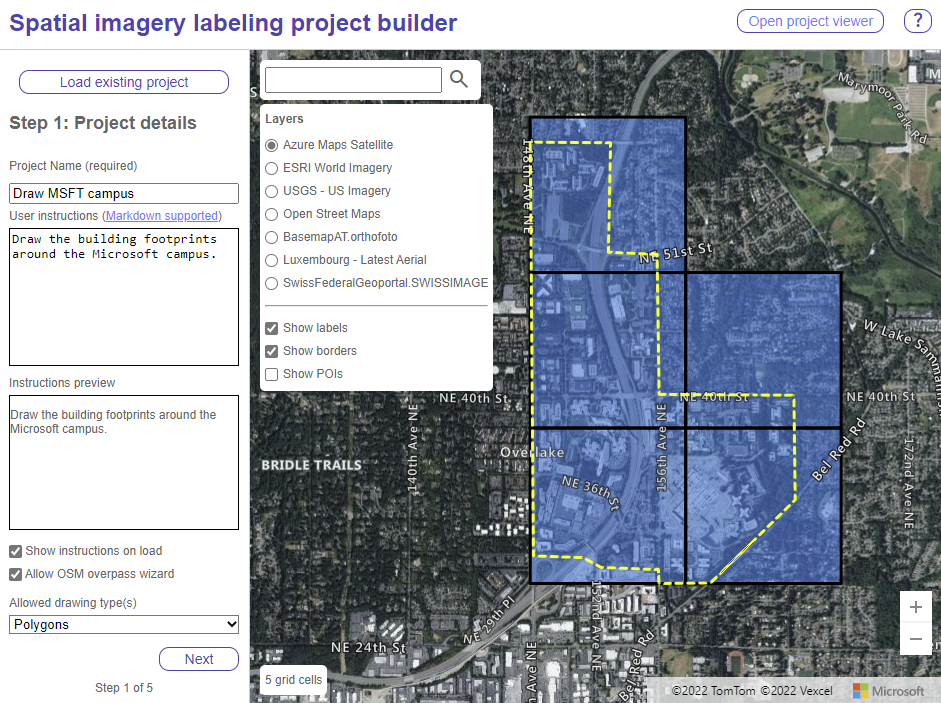

# Project Builder tool

The project builder is the tool used by a project administrator to define a labeling project and break it up into a set of smaller sub-tasks that can be assigned to a group of people who will do the labeling. 

## Project Builder quickstart

1. Open the [project builder tool](../src/projectBuilder.html). Note that if you have forked this project you URL will be different.
2. There are 5 steps to complete. If you have an existing project saved that you want to open and edit, use the "Open existing project" button that appears in the first step.
3. In step one, define the high level information for the project. 
    - Project name - Required. Specifies the name of the project. This is displayed in the top left corner of the labeler tool when the user loads one of the generated task files. You will not be able to move to the next step until this has been specified.
    - User instructions - Optional. Additionl instructions you want to display to the user when they use the tool. It is good to provide atleast a short discription of what they should be capturing. Note that markdown can be used to format the instructions and a preview will appear in the "Instructions preview" section.
    - Show instructions on load - Optional. When enabled the instructions will be displayed to the user when they load the task. If disabled, the instructions will be loaded into the instructions panel, but not openned and display when loading a task.
    - Allow OSM overpass wizard - Optional. When enabled, users can import data from Open Street Maps. This can be very useful when working with common spatial objects, such as building footprints, however it is possible the data may not align with the imagery. Uncheck this option if you want to disable this feature. See the [Import existing data](Labeler.md#import-existing-data) section of the labeler instructions for more details. 
    - Allowed drawing type(s) - Optional. Allows you to specify what type of features the user can draw. The following options are available:
      - Polygons - polygons, rectangles, and circles
      - Rectangles only
      - Lines
      - All - any of the above
4. In step two, load and select imagery layers that should be used in the project. There are some layers available by default as specified in the `src -> settings -> project_admin_settings.js` file. You can add additionally layers using the "+Add new layer(s)" button. See the [Imagery layers documentation](Layers.md) for more details. Use the checkboxes in the layer list to specify which layers will in the labeling tool. Press "Next" to go to the next step.
5. In step three, you define the focus area (area of interest) for the whole project. Zoom the map in, or use the search bar to quickly bring the map to where you want. Then use the drawing tools to draw the area, or import a spatial data file with your area polygon (or multipolygon) using the "Import area" button. The supported spatial data file formats are GeoJSON, GeoJSONL, KML, KMZ, GeoRSS, GML, CSV (with a column with well known text of features). Only the first shape in the data file will be imported. When the area is drawn or loaded, a grid  will appear, these are the individual task areas that you will be able to assign to users of the labeling tool. Adjust the size of the grid using the "Grid size units" and "Gride size" options. Press "Next" to go to the next step.
6. In step 4, you define the class information you want the users to assign to the features they draw. If you only want to capture one type of information, simply create one primary class. You can customize the display name and property name that captures the class information in the labeling tool. Create classes by typing in the name in the text box that has the green plus (+) beside it, then press that green plus(+) sign button. The class name will be added to a list with a color picker beside it. Click on the color to change it if desired. Optionally, capture a second class by clicking the checkbox, customize the display name, property name, and add names in a similar manner as the primary class. There is no color option for the secondary class. Press "Next" to go to the next step.
7. In step 5, the generated labeling project can be download. Optionally you can have links to the labeling tool generated with a `&taskUrl=` parameter that will load the individual labeling task from the location you have hosted the files (requires files to be hosted on a CORs enabled endpoint). When ready, press the download button. See [Output file format](#output-file-format) section for more details on the output of the project builder tool.
8. Share the task files or links to the labeling tool that will load their task file with the people who will be doing the labeling. See [Sharing task files](#sharing-task-files) section for more details. 
9. Once they have completed the labeling and sent you the results, add the output files to the results folder of the project folder. When you have collected all the results, zip the project folder and load it into the project viewer to view and merge all the results. See the [Project viewer documentation](Project-viewer.md) for more details. 

## Sharing task files

Once the task files for your project have been created you will most likely want to assign/share them with the users who will be doing the labeling. For smaller projects, the easiest method would be to email a task file to each individual user and keep track of the progress in the generated `summary.csv` file. For larger labeling jobs, it will likely be much easier to host the task files on a CORs enabled endpoint, such as Azure Blob storage, and then send out a URL with the link to the labeler with the task file URL passed into the `taskUrl` URL parameter `https://exampe.com/labeler.html?taskUrl=[URL to hosted task file]`. Note that the hosting location of the task files will need CORs and `https` enabled. See the next section for an example of one way to do this. See [Output file format](#output-file-format) section for more details on the output of the project builder tool.

## Hosting files in a CORs enabled Azure Blob storage

Warning, the following steps will allow the files you load into this blob storage account to be publicly accessible across domains. This is fine in most scenarios for imgaery and task files, however, if you have sensitive data, it is better to use local files, or to fork this project and modify it to work with your data in a secure manner.

1. If you don't have one all ready, go into the Azure portal and create a [blob storage account resource](https://learn.microsoft.com/azure/storage/blobs/storage-quickstart-blobs-portal).
2. Go to the blob storage account resource in the Azure portal that will be hosting your files. 
3. Under "Settings" click on the "Resource Sharing (CORs)" button. 
4. Under the "Blob services" section add new entry with the following options:

| Allowed origins | Allowed methods | Allowed headers | Exposed headers | Max age |
|-----------------|-----------------|-----------------|-----------------|---------|
| `*` | `GET` | `*` | `*` | `360000` |

## Output file format

The output of the project builder is a zip file that has the following structure:

The output zip file will have the same name as the prject name you specified, with spaces replaced with underscores (_). The tasks in the task folder also use the project name and have a task number appended to it. The `project_builder_settings.json` file contains all the settings used to create the project. The `summary.csv` file

Also see the [Result file format](#result-file-format) documentation for more details on the output data schema of the labeler tool.

### Task file format

The individual task files are a GeoJSON file that contain a feature collection with a single feature. The `geometry` of this feature defines the outline of the task area. The `id` of the feature is the ID of the individual task and should match the name of the task file. The `bbox` property is the bounding box area of the `geometry`, and is used by the labeler to set the initial viewing area when the task is loaded. The `properties` of the feature contain the following information:

| Property name | Type | Description |
|--|--|--|
| `project_name` | `string` | Name of the project. |
| `name` | `string` | Same as the id of the Feature |
| `instructions` | `string` | Instructions provided by the admin creating the project. Usually, will be unique to the task at hand. For example: “capture building footprints”.  May contain HTML. |
| `instructions_on_load` | `boolean` | Indicates is the instructions panel will open when the config file is loaded, starting the user off with the instructions. |
| `allow_wizard` | `boolean` | Indicates if the user can use the OSM Overpass wizard. If set to false, hide this feature. |
| `drawing_type` | `string` | Specifies the type of drawing a user of the labeler is allowed to do. Options:  · all – Can draw lines, polygons, rectangles, and circles. · lines – Allows drawing lines. · polygons – Allows drawing polygons, rectangles, and circles. · rectangles – Allows drawing rectangles only.  If set to rectangle, OSM wizard will be disabled. |
| `layers` | `{"[name]": {layeroptions}}` | An object where the key is the name of the layer. Each layer has a set of options as defined in Azure Maps.  · [ImageLayerOptions interface](https://docs.microsoft.com/javascript/api/azure-maps-control/atlas.imagelayeroptions?view=azure-maps-typescript-latest) · [TileLayerOptions interface](https://docs.microsoft.com/javascript/api/azure-maps-control/atlas.tilelayeroptions?view=azure-maps-typescript-latest) · [OgcMapLayerOptions interface](https://docs.microsoft.com/javascript/api/azure-maps-spatial-io/atlas.ogcmaplayeroptions?view=azure-maps-typescript-latest)  All options will be extended to include a "type" property that contains the class name of the layer: `ImageLayer`, `TileLayer`, `OgcMapLayer`. |
| `primary_classes` | `{"property_name":  string,"names": string[],"colors": string[]}` | An object that contains the property name the class is stored in, an array of class names, and array of colors. Names, and colors array expected to be the same length, with name to color pairing having matching indices. |
| `secondary_classes` | `{"property_name":  string,"names": string[]}` | An object that contains the property name the class is stored in, and an array of class names. |

## Project admin settings

If you fork this project you can customize the default settings of the project. The `src -> settings -> project_admin_settings.js` file contains the common settings used by the project builder and viewer tools. The `src -> settings -> map_settings.js` file contains the common settings used by the map in all tools. The `src -> settings -> labeler_settings.js` file contains the settings for the labeler tool.
