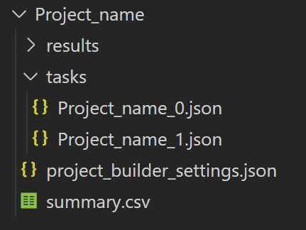

# Project Builder tool

The project builder is the tool used by a project administrator to define a labeling project. In the project builder, administrators can also break the project up into a set of smaller sub-tasks that can be assigned to a group of people who will do the labeling.

## Project Builder quickstart

1. Open the [project builder tool](https://microsoft.github.io/satellite-imagery-labeling-tool/src/projectBuilder.html). Under the heading labeled **Step 1: Project details**, there are a series of fields for you to fill in. There are five different sections like this to complete.
   
     > **Note:** If you have forked this project, your URL will be different.

2. Choose one of the following: 
   - To open and edit an existing project that you have saved, click **Load existing project**, which appears above the **Step 1: Project details** heading.
   - To create a **new project** from scratch, move on to **Step 1: Project Details**.
### Step 1: Project Details
1. Under **Project Name**, type the name of your new project. When the user loads one of the generated task files in the labeler tool, the **Project Name** displays in the top left corner.
     
     > **Note:** This field is required, so you are unable to move to the next step until a **Project Name** is specified.

2. Under **User instructions**, type the instructions that you want to display to the user when they use the labeling tool. This field is optional, but it is helpful to provide a short description of what the user should be capturing. A preview of your instructions appears under **Instructions preview**.
     
     >**Tip:** Markdown is allowed for formatting the instructions.  

3. Click the checkbox next to **Show instructions on load** if you want your instructions to display to the user when they load the task to the labeling tool. If unchecked, the instructions will be loaded into the instructions panel, but not displayed in the labeling tool when a user loads a task. 
   
4. Click the checkbox next to **Allow OSM overpass wizard** if you want your users to be allowed to import data from Open Street Maps. This is optional, but it is useful when working with common spatial objects such as building footprints.
     
     > **Note:** It is possible that the data may not align with the imagery. If unchecked, this feature is disabled. See the [Import existing data](Labeler.md#import-existing-data) section of the labeler instructions for more details.

5. Click the checkbox next to **Allow data import from custom service** if you want to add a custom service that can be used to import data within a bounding box and returns a GeoJSON feature collection. 
     
     > **Important:** The service must be hosted on a CORs enabled endpoint. 
  
     Upon checking the **Allow data import from custom service** box, two more fields appear labeled **Button name** and **Data service**:
   - Under **Button name**, type the name you want to display on the button (i.e., "Add custom data").
   - Under **Data service**, type the URL to the data service with a placeholder "{bbox}" that takes in bounding box coordinates in the format "minLon,minLat,maxLon,maxLat".
     
     > **Important:** This must return a GeoJSON feature service. This could be a custom service, or an [OGC API Feature service (WFS 3.0)](https://github.com/opengeospatial/ogcapi-features).

6. Click the field under **Allowed drawing type(s)** to specify what type of features the user can draw. A drop-down menu appears and the following options are available:
   - **Polygons** - polygons, rectangles, and circles
   - **Rectangles** only
   - **Lines**
   - **All** - any of the above
    
7. Click **Next** to continue to **Step 2: Add Layers**, where you can add and/or import the imagery layers that you want to appear in the labeling tool and be used in the project.
### Step 2: Add Layers
1. Under **Layer List**, click the checkbox next to the imagery layers that should appear in the labeling tool and be used in the project. There are some layers available by default, as specified in the `src -> settings -> project_admin_settings.js` file. 
   
2. To add your own imagery layers, click **+Add new layer(s)**. See the [Imagery layers documentation](Layers.md) for more details. 
3. Click **Next** to continue to **Step 3: Create focus area**, where you define the area of interest for the whole project.
### Step 3: Create focus area
1. Zoom in on the map to the focus area of your project. You can do this a few different ways:
   -  Type your area of interest into the **search bar** at the top left of the map, next to the magnifying glass icon.
   - Use your **mouse** or **keypad** to zoom in to the focus area.
   - Use the **plus(+)** and **minus(-)** buttons at the bottom right corner of the map to zoom in or out of the focus area.
    
2. Use the drawing tools to draw the area of interest by clicking on one of the icons before drawing. There are four tools to work with: 
   - Draw a **polygon**
   - Draw a **square**
   - Draw a **circle**
   - **Edit** the shape 
    

3. If you want to import a spatial data file with your area polygon (or multipolygon), click **Import area** under **Gridding options**. Only the first shape in the data file imports.

   > **Important:** The supported spatial data file formats are GeoJSON, GeoJSONL, KML, KMZ GeoRSS, GML, CSV (with a column with well known text of features).
  
     When the area is drawn or loaded, a grid appears. The grid controls the amount and size of individual task areas that you are able to assign to users of the labeling tool.

4. Under **Grid size units**, adjust the units if necessary.
   
5. Under **Grid size**, use the down and up arrows to adjust the size of the grid. This helps to  adjust the number of individual task areas that you want to create.
   
6. Click **Next** to continue to **Step 4: Define classes**, where you define the class information that you want the users to assign to the features they draw.
### Step 4: Define classes
1. Under **Primary class display name**, type the name that you want to display for your primary class information.
   
2. Under **Primary class property name**, type the property name that captures the primary class information in the labeling tool.
   
3. Under **Primary classes**, type the name of the primary class.
   
4. Click the green **plus(+)** button next to the primary class to officially add it. The class name is added to the list with a color picker square next to it.
   
   > **Note:** The tool allows you to create multiple primary classes. To do so, type another primary class name under **Primary classes** and click the green **plus(+)** button to add it to the list.

     To change the color of your primary classes, click the color picker square next to its name and choose a color. This is especially useful when you have multiple primary classes.

5. To capture a secondary class, click the checkbox next to **Capture secondary class**. A series of fields to fill in appear under **Capture secondary class**. The information that you need to fill in here provides similar options for customization as the primary class information, except that there is no option to customize the color of your secondary classes.
   
6. If you choose to capture a secondary class, customize the display name, property name, and add names in a similar manner as the primary class.
   
7. Click **Next** to continue to **Step 5: Complete**, where you download the project files.
### Step 5: Complete
1.  If you want to have links to the labeling tool generated with a `&taskUrl=` parameter that will load the individual labeling task from the location you have hosted the files, click the checkbox next to **Include task file links in summary**. 
   
    >  **Note:** This requires files to be hosted on a CORs enabled endpoint.

     See the [Output file format](#output-file-format) section for more details on the output of the project builder tool.

2.  Click **Download project files** to download.
3.  Share the task files or links to the labeling tool that will load their task file with the people who will be doing the labeling. See [Sharing task files](#sharing-task-files) section for more details.
4.  Once the users have completed the labeling and sent you the results, add the output files to the **results** folder of the overall project folder. 
5.  When you have collected all the results, zip the overall project folder and load it into the **project viewer** to view and merge all the results. See the [Project viewer documentation](Project-viewer.md) for more details.

## Sharing task files

Once the task files for your project have been created you will most likely want to assign/share them with the users who will be doing the labeling. 
### For smaller projects 
For smaller projects, the easiest method would be to email a task file to each individual user and keep track of the progress in the generated `summary.csv` file. 
### For larger labeling jobs
For larger labeling jobs, it will likely be much easier to host the task files on a CORs enabled endpoint, such as Azure Blob storage, and then send out a URL with the link to the labeler with the task file URL passed into the `taskUrl` URL parameter `https://example.com/labeler.html?taskUrl=[URL to hosted task file]`. 
> **Note** that the hosting location of the task files will need CORs and `https` enabled. See the next section for an example of one way to do this. 
 
 See [Output file format](#output-file-format) section for more details on the output of the project builder tool.

## Hosting files in a CORs enabled Azure Blob storage

**Warning:** The following steps will allow the files you load into this blob storage account to be **publicly accessible across domains**. If you have **sensitive data**, it is better to use local files or fork this project and modify it to work with your data in a secure manner.

1. If you don't have one already, go into the Azure portal and create a [blob storage account resource](https://learn.microsoft.com/azure/storage/blobs/storage-quickstart-blobs-portal).
2. Go to the blob storage account resource in the Azure portal that will be hosting your files.
3. Under **Settings**, click on the **Resource Sharing (CORs)** button.
4. Under the **Blob services** section, add new entry with the following options:

| Allowed origins | Allowed methods | Allowed headers | Exposed headers | Max age |
|-----------------|-----------------|-----------------|-----------------|---------|
| `*` | `GET` | `*` | `*` | `360000` |

## Output file format

The output of the project builder is a zip file with following structure:

* The **output zip file** will have the same name as the project name you specified, with spaces replaced with underscores (_). 
* The tasks in the **task** folder use the project name, and have a task number appended to it. 
* The `project_builder_settings.json` file contains all the settings used to create the project. 
* The `summary.csv` file contains all of the individual tasks that you defined using the grid in the project builder. This is a useful file for assigning those individual tasks to annotators.

See the [Result file format](#result-file-format) documentation for more details on the output data schema of the labeler tool.

### Task file format

The individual task files are GeoJSON files that each contain a feature collection with a single feature. 
* The `geometry` of this feature defines the outline of the task area. 
* The `id` of the feature is the ID of the individual task and should match the name of the task file. 
* The `bbox` property is the bounding box area of the `geometry`, and is used by the labeler to set the initial viewing area when the task is loaded. 
* The `properties` of the feature contain the following information:

| Property name | Type | Description |
|--|--|--|
| `project_name` | `string` | The name of the project. |
| `name` | `string` | The same as the id of the Feature. |
| `instructions` | `string` | Instructions provided by the admin creating the project.   Usually, will be unique to the task at hand. For example: “capture building footprints”.     May contain HTML. |
| `instructions_on_load` | `boolean` | Indicates if the instructions panel will open to show users the instructions when the config file is loaded. |
| `allow_wizard` | `boolean` | Indicates if the user can use the OSM Overpass wizard.   If set to false, hide this feature. |
| `customDataService` | `string` | The display name that the user sees for a button that imports data from a custom data service. |
| `customDataServiceLabel` | `string` | A formatted URL to a custom data service to pull in external data from a bounding box. |
| `drawing_type` | `string` | Specifies the type of drawing a user of the labeler is allowed to do. The options are:   · **all** – Can draw lines, polygons, rectangles, and circles. · **lines** – Allows drawing lines. · **polygons** – Allows drawing polygons, rectangles, and circles. · **rectangles** – Allows drawing rectangles only.  If set to rectangle, OSM wizard will be disabled. |
| `layers` | `{"[name]": {layeroptions}}` | An object where the key is the name of the layer. Each layer has a set of options as defined in Azure Maps.  · [ImageLayerOptions interface](https://docs.microsoft.com/javascript/api/azure-maps-control/atlas.imagelayeroptions?view=azure-maps-typescript-latest) · [TileLayerOptions interface](https://docs.microsoft.com/javascript/api/azure-maps-control/atlas.tilelayeroptions?view=azure-maps-typescript-latest) · [OgcMapLayerOptions interface](https://docs.microsoft.com/javascript/api/azure-maps-spatial-io/atlas.ogcmaplayeroptions?view=azure-maps-typescript-latest)  All options will be extended to include a "type" property that contains the class name of the layer: `ImageLayer`, `TileLayer`, `OgcMapLayer`. |
| `primary_classes` | `{"property_name":  string,"names": string[],"colors": string[]}` | An object that contains:  · The property name that the class is stored in  · An array of class names  · An array of colors   Names and colors are expected to be the same length, with name to color pairing having matching indices. |
| `secondary_classes` | `{"property_name":  string,"names": string[]}` | An object that contains:  · The property name the class is stored in  · An array of class names |

## Project admin settings

If you fork this project, you can customize the default settings of the project. 
* The `src -> settings -> project_admin_settings.js` file contains the common settings used by the project builder and viewer tools. 
* The `src -> settings -> map_settings.js` file contains the common settings used by the map in all tools. 
* The `src -> settings -> labeler_settings.js` file contains the settings for the labeler tool.
