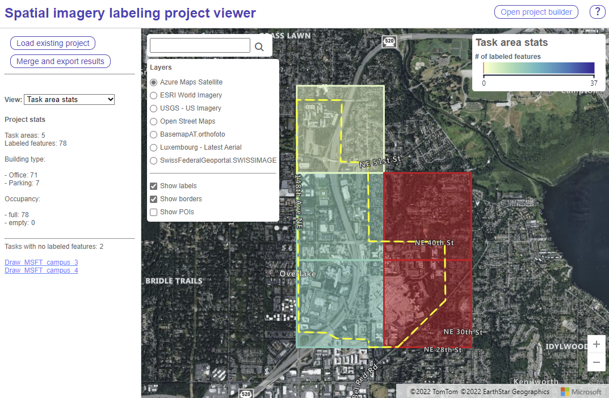

# Project Viewer tool

The project viewer is the tool used by a project administrator to view and merge the results from the project. See stats and easily identify which areas have little to no labels.

## Project Viewer quickstart

1. If you haven't already, collect the output files created by the labeler for each task and put them into the `results` folder of the output of the project builder. Zip the project builder folder.
2. Open the [project viewer tool](https://microsoft.github.io/satellite-imagery-labeling-tool/src/projectViewer.html). Note that if you have forked this project you URL will be different.
3. Load your project into the viewer by using the "Load existing project" button in the left side panel. Select your zipped project folder that contains the task results in the results folder. When loaded stats for the project will appear in the left side panel. The map will display all the task areas, colored based on the number of labeled features in each area. Red areas indicate that few, if any features, have been labeled in that task area.
4. Use the dropdown in the left side panel to view the invidiual features colored by primary or secondary class.
5. Click the "Merge and export results" button to merge and export the results. The output file is a GeoJSON file containing a feature collection of all the drawn features. Each feature will have details in its properties; at a minimum the primary and secondary class, `source`, and `task_name`, the same as the [Result file format](Labeler.md#result-file-format) from the labeler.
